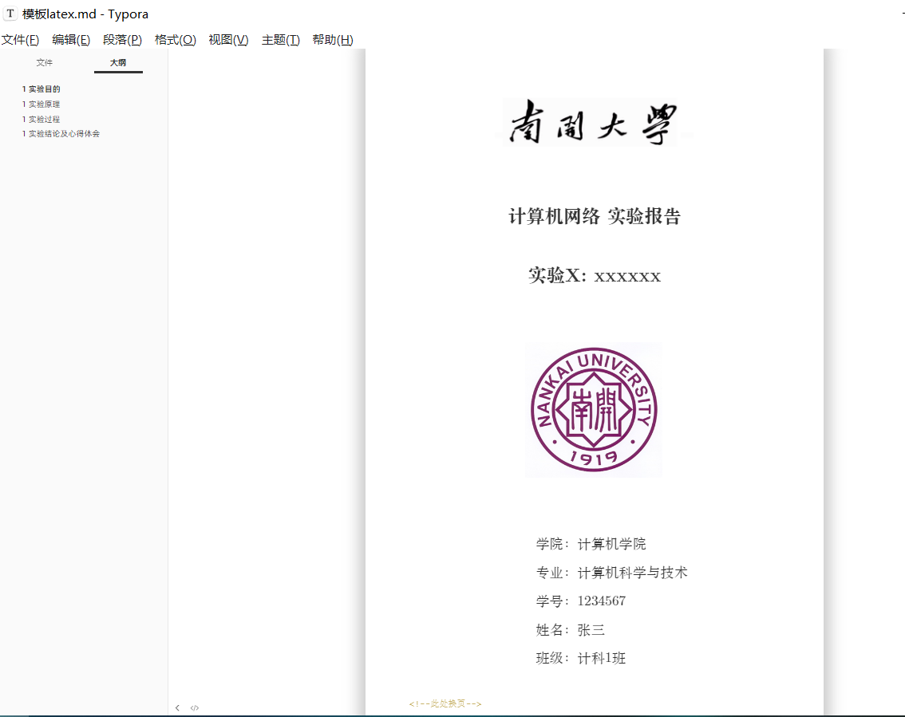

# NKU-share
 本人NKU计网课程作业和资料

有需求自取，请点个Star~

如有任何意见或建议，可以issue或联系本人~

​	报告类基本采用`Typora + markdown + latex主题`编写，使用所见即所得的md书写既美观又有效率，详见`/模板`。

typora的latex主题使用方法见[Keldos-Li/typora-latex-theme: 将Typora伪装成LaTeX的中文样式主题，本科生轻量级课程论文撰写的好帮手。This is a theme disguising Typora into Chinese LaTeX style.](https://github.com/Keldos-Li/typora-latex-theme)，效果如下图：

