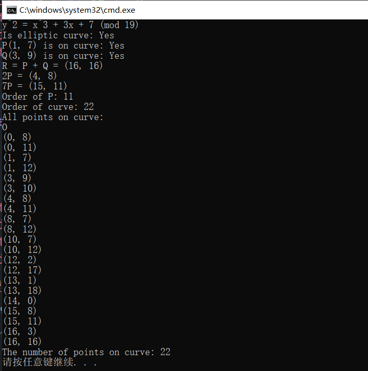

<h2 align = "center">椭圆曲线编程报告</h2>

<div align=center>姓名：齐明杰&nbsp; 学号：2113997&nbsp;班级：信安2班</div>

#### **一、编程要求**

> - 源码文件：`xxx.cpp、xxx.h`
> - PE文件: `exe`等
> - 演示说明视频：<3min，包含对写好的测试样例的演示和对核心部分的讲解说明
> - 实验报告：2123456张三椭圆曲线编程练习报告.doc 或 2123456张三椭圆曲线编程练习报告.pdf

#### **二、源码部分**

```c++
#include<bits/stdc++.h>
using namespace std;

struct Point {
    int x, y;
    bool inf; // 是否为无穷远点
    Point(int x, int y) : x(x), y(y), inf(false) {}
    Point(bool inf) : x(0), y(0), inf(inf) {}  // 用于创建无穷远点
    bool operator==(const Point& other) const {
        if(inf != other.inf) return false;
        if(inf && other.inf) return true;
        return x == other.x && y == other.y;
    }
    bool operator!=(const Point& other) const { return !(*this == other); }
};


class EllipticCurve {
public:
    int a, b, p;
    Point ZERO; // 定义无穷远点

    EllipticCurve(int a, int b, int p) : a(a), b(b), p(p), ZERO(true) {}

    // 求最大公约数
    int gcd(int a, int b) { return b ? gcd(b, a % b) : a; }

    // 扩展欧几里得算法求逆元
    int inverse(int a,int m){
        while(a < 0) a += m; 
        if(gcd(a, m) != 1) return -1;
        int r, q, s1 = 1, s2 = 0, s3, t1 = 0, t2 = 1, t3 = 1, mt = m;
        while(1){
            r = m % a; q = m / a;
            if(!r) break;
            m = a; a = r;
            s3 = s1 - q * s2;
            t3 = t1 - q * t2;
            s1 = s2; s2 = s3;
            t1 = t2; t2 = t3;
        }
        while(t3 < 0) t3 += mt;
        return t3;
    }

    // 判断是否为椭圆曲线
    bool isEllipticCurve() {
        return (4 * a * a * a + 27 * b * b) % p != 0;
    }

    // 判断点是否在曲线上
    bool isOnCurve(const Point& P) {
        if (P== ZERO) return true;
        return (P.y * P.y - P.x * P.x * P.x - a * P.x - b) % p == 0;
    }

    // 计算P+P
    Point doublePoint(const Point& P) {
        int s = ((3 * P.x * P.x + a) * inverse(2 * P.y, p)) % p;
        while(s < 0) s += p;
        int xR = (s * s - 2 * P.x) % p;
        while(xR < 0) xR += p;
        int yR = (s * (P.x - xR) - P.y) % p;
        while(yR < 0) yR += p;
        return Point(xR, yR);
    }

    // 计算两点之和
    Point addPoints(const Point& P, const Point& Q) {
        if (P == ZERO) return Q;
        if (Q == ZERO) return P;
        if (P == Q) return doublePoint(P);
        if (P.x == Q.x) return ZERO;
        int s = ((Q.y - P.y) * inverse(Q.x - P.x, p)) % p;
        while(s < 0) s += p; 
        int xR = (s * s - P.x - Q.x) % p;
        while(xR < 0) xR += p;
        int yR = (s * (P.x - xR) - P.y) % p;
        while(yR < 0) yR += p;
        return Point(xR, yR);
    }

    // 使用倍加-和算法计算mP 
    Point multiplyPoint(const Point& P, int m) {
        Point R = ZERO;
        Point Q = P;
        while (m) {
            if (m & 1) R = addPoints(R, Q);
            Q = doublePoint(Q);
            m >>= 1;
        }
        return R;
    }

    // 计算点的阶
    int orderOfPoint(const Point& P) {
        if (!isOnCurve(P)) return -1;
        if (P == ZERO) return INT_MAX;
        Point Q = P;
        int order = 1;
        while (Q != ZERO) {
            Q = addPoints(P, Q);
            order++;
        }
        return order;
    }

    // 计算曲线的阶
    int orderOfCurve() {
        vector<Point> points = allPoints();
        return points.size();
    }

    // 计算曲线上的所有点
    vector<Point> allPoints() {
        vector<Point> points{ZERO};
        for (int x = 0; x < p; x++) {
            for(int y = 0; y < p; y++) {
                if (isOnCurve(Point(x, y))) {
                    points.push_back(Point(x, y));
                }
            }
        }
        return points;
    }
};


int main() {
    // 创建一个椭圆曲线 y^2 = x^3 + ax + b (mod p)
    int a = 3, b = 7, p = 19;
    EllipticCurve curve(a, b, p); // 三个参数分别为 a, b, p
    printf("y^2 = x^3 + %dx + %d (mod %d)\n", a, b, p);
    printf("Is elliptic curve: %s\n", curve.isEllipticCurve() ? "Yes" : "No");

    // 创建两个点 P, Q
    Point P(1, 7);
    Point Q(3, 9);

    // 检查这两个点是否在曲线上
    printf("P(%d, %d) is on curve: %s\n", P.x, P.y, curve.isOnCurve(P) ? "Yes" : "No");
    printf("Q(%d, %d) is on curve: %s\n", Q.x, Q.y, curve.isOnCurve(Q) ? "Yes" : "No");

    // 计算两点之和 R = P + Q
    Point R = curve.addPoints(P, Q);
    printf("R = P + Q = (%d, %d)\n", R.x, R.y);

    // 计算2P
    Point twoP = curve.doublePoint(P);
    printf("2P = (%d, %d)\n", twoP.x, twoP.y);

    // 计算kP
    int k = 7;
    Point sevenP = curve.multiplyPoint(P, k);
    printf("%dP = (%d, %d)\n", k, sevenP.x, sevenP.y);

    // 计算点P的阶
    int orderP = curve.orderOfPoint(P);
    printf("Order of P: %d\n", orderP);

    // 计算曲线的阶
    int orderCurve = curve.orderOfCurve();
    printf("Order of curve: %d\n", orderCurve);

    // 计算曲线上的所有点
    vector<Point> points = curve.allPoints();
    printf("All points on curve:\n");
    for (const Point& point : points) {
        if(point == curve.ZERO) printf("O\n");
        else printf("(%d, %d)\n", point.x, point.y);
    }
    printf("The number of points on curve: %llu\n", points.size());
    system("pause");
    return 0;
}

```

#### **三、代码说明**

1. **定义点：**

	在代码中，首先定义了一个 `Point` 结构体来表示椭圆曲线上的点。它包含两个整数字段 `x` 和 `y`，分别表示点的坐标。此外，还包含一个布尔字段 `inf`，表示该点是否是无穷远点。在椭圆曲线算法中，无穷远点扮演了重要的角色，如同整数中的0元素。

2. **定义椭圆曲线：**

	`EllipticCurve` 类定义了一个椭圆曲线。它由公式 `y^2 = x^3 + ax + b (mod p)` 定义。类中的字段 `a`、`b`、`p` 就是这个公式中的参数。特别地，`p` 是质数，表示我们正在操作的是一个有限域。

3. **椭圆曲线的基本操作：**

	`EllipticCurve` 类提供了一系列用于操作椭圆曲线和其中点的方法：

	- `isEllipticCurve()` 检查 `4a^3 + 27b^2 ≠ 0 (mod p)` 来确保这是一个有效的椭圆曲线。
	- `isOnCurve(Point P)` 检查点 `P` 是否满足椭圆曲线的公式，即 `y^2 ≡ x^3 + ax + b (mod p)`。
	- `addPoints(Point P, Point Q)` 计算两点 `P` 和 `Q` 的和。这是通过椭圆曲线加法完成的。
	- `doublePoint(Point P)` 计算点 `P` 的两倍，也就是 `P + P`。这是通过切线方法计算的。
	- `multiplyPoint(Point P, int m)` 计算点 `P` 的 `m` 倍。这是通过**倍加-和**方法完成的。
	- `orderOfPoint(Point P)` 和 `orderOfCurve()` 分别计算了一个点的阶和椭圆曲线的阶。阶是椭圆曲线密码学中的一个重要概念。
	- `allPoints()` 方法计算了椭圆曲线上所有的点。

在 `main` 函数中，创建了一个椭圆曲线，并执行了一些基本操作，包括添加点、倍增点、计算点的阶和曲线的阶，以及列出曲线上的所有点。

#### **四、运行结果**



与样例一致，证明了代码的正确性。