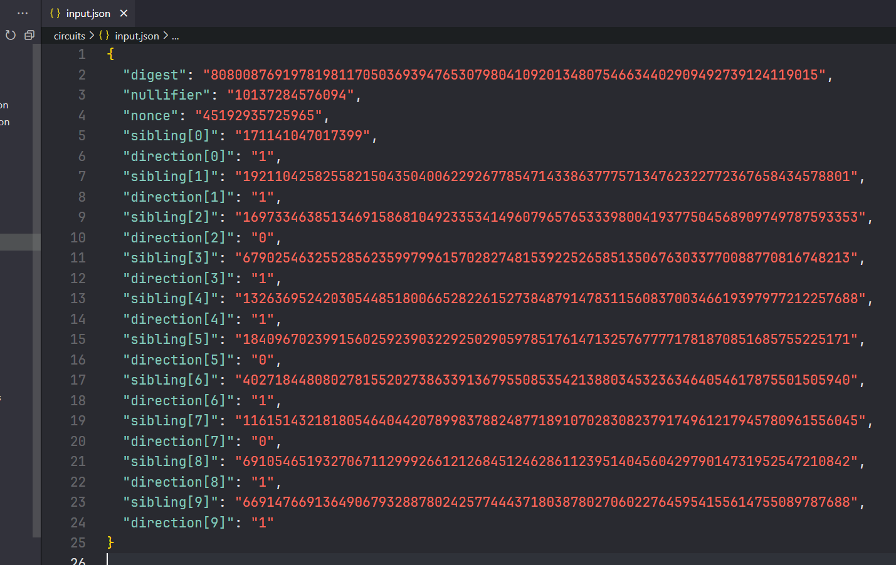

# 区块链基础及应用 2023 Exercise 6

<div align=center>姓名：李帅东&nbsp; 学号：2111231&nbsp;</div>

<div align=center>姓名：齐明杰&nbsp; 学号：2113997&nbsp;</div>

## 实验目的

​	在这个实验里，你会学到 circom，一个描述算术电路的工具 snarkjs，一种用于生成和验证电路满意度的 zk-SNARKs 的工具。 本实验建议使用 Ubuntu 20.04 以上的版本运行。

​	你将使用以下知识来探索私有事务（private transactions）的实现： 

- 制作一个简单的版本的花费 Tornado 的电路

- 生成赎回 Tornado 的有效性证明。

## 实验流程

### 配置环境

根据助教给的配置文件包中的步骤进行配置环境。

### 了解`circom`

#### 回答writeup当中的问题

**要求：填写至`artifacts/writeup.md`当中。**

**为了方便助教审阅，我将三个问题的答案粘贴到此处。**

```APL
Answer1:
 `sum_of_bits` 实际上只是输入信号 `bits[i]` 的线性组合。其原因在于`2**i` 不是信号，而只是一个常量值（由依赖于 `n` 的 `i` 定义）。
```

```APL
Answer2:
`<==` 运算符基本上是 `<--` 和 `===` 运算符的组合，它既分配了一个值给信号，又意味着从分配中派生的合同成立。它基本上只是一种快捷方式，允许我们在分配信号的值是线性组合时避免使用两个运算符。
```

```apl
Answer3:
这个表达式 `(a & 1) * b === c` 是无效的，因为其中使用了 `&` 运算符，表示按位与操作。在电路约束的上下文中，按位`&`操作并不能得到输入信号的线性组合，因此约束不能简化为rank-1形式的 `a*b + c = 0`。因此，给定的表达式违反了在这个上下文中有效约束的要求。
```

#### 为`SmallOddFactorization`电路创建7\*17\*19=2261的证明

**要求：将验证密钥`verifier key`保存到`artifacts/verifier_key_factor.json `,将证明保存到`artifacts/proof_factor.json`**

- `SmallOddFactorization(n,b)`在`circuits/example.circom`当中。

- 使用指令`circom example.circom -o circuit.json`编译circuit，得到`circuit.json`文件。

- 创建新的文件，名字为`input.json`，这个输入文件指定了`factors`数组和`product`的值，也就是我们所要证明的知识就在这里头了。

  其内容如下：

  ``` APL
  {
  "factors":[7,17,19],
  "product":2261
  }
  ```

- 将编译好的`circuit.json`拖入`snarkjs`

  - > `snarkjs info -c circuit.json`可以用来查看这个circuit的常规数据

  - > `snarkjs printconstraints -c circuit.json`可以用来打印这个circuit的约束

  - 使用指令`snarkjs setup`指令来为我们的circuit进行setup。这个指令会寻找`circuit.json`。如果想要寻找特定的文件，可以使用参数`-c <circuit JSON file name>`。

  - 使用指令`snarkjs calculatewitness`来计算出witness（目击证人），说明我们确实有这个知识.（知识已经在上一步骤，`input.json`里头写好了,这条指令依赖于`input.json`而执行，因此，必须要先写input.json再执行指令），之后，就会生成`witness.json`文件。

  - 使用指令`snarkjs proof`生成证据。这条指令会默认地使用`proving_key.json`和`witness.json`去创建`proof.json`和`public.json`。其中，`proof.json`文件之中包含着确实的证据。`piblic.json`文件将会包含公共的输入和公共的输出


到此，我们就有了我们的验证密钥和证据。详见`artifacts/verifier_key_factor.json`为验证密钥，`artifacts/proof_factor.json`为证据。

使用`snarkjs verify`验证，得到OK！


### 开关电路

#### `circuits/spend.circom`:IfThenElse

```json
template IfThenElse() {
    signal input condition;
    signal input true_value;
    signal input false_value;
    signal output out;

    // TODO
    // Hint: You will need a helper signal...
    // 条件必须为0或1。
    condition * (1 - condition) === 0;

    // 中间信号值，因为约束必须为ab + c = 0的形式
    signal diff <-- true_value - false_value;

    // 在条件为1的情况下，有：out = 1 * (true_value - false_value) + false_value = true_value
    // 在条件为0的情况下，有：out = 0 * (true_value - false_value) + false_value = false_value
    out <== condition * diff + false_value;
}
```

`IfThenElse（）`要求，如果condition为1，out就是true_value;如果condition为0，out就是false_value.

`condition*(1-condition)===0`强制条件信号 必须为0或1；

之后，根据 `out=（true_value-false_value）*condition+false_value`，直接将`out`转化为`true_value`和`false_value`的线性表达。我们不难验证，当condition为1时，outtrue_value;当condition为0时，outfalse_value.

#### `circuits/spend.circom`:SelectiveSwitch

```json
template SelectiveSwitch() {
    signal input in0;
    signal input in1;
    signal input s;
    signal output out0;
    signal output out1;

    // TODO
    // 强制 s 为 0 或 1。
    s * (1 - s) === 0;

    // 使用两个 if 语句确定输出值。

    // 如果 (s == 1) 则输出 in1，否则输出 in0
    component firstOutput = IfThenElse();
    firstOutput.condition <== s;
    firstOutput.true_value <== in1;
    firstOutput.false_value <== in0;

    // 如果 (s == 1) 则输出 in0，否则输出 in1
    component secondOutput = IfThenElse();
    secondOutput.condition <== s;
    secondOutput.true_value <== in0;
    secondOutput.false_value <== in1;

    // 输出信号必须等于 if 语句的结果
    out0 <== firstOutput.out;
    out1 <== secondOutput.out;
}
```

该函数实现了选择性开关，根据输入的选择信赖来输出不同的值。

- `s*(1-s)===0`是要强制的选择信号s为0或1.

- 然后，使用两个`IfThenElse()`组件，根据信号s的值来确定输出值。
  - 第一个组件`firstOutput`是根据s的值来选择输出in1或in0
  - 第二个组件`SecondOutput`是根据选择信号s的值来输出in1或in0
- 最后，将以上两个组件的输出连接到输出信号out0和out1上。

不难验证：

- s为1时，第一个组件输出out0为in1；第二个组件输出out1为in0；
- s为0时，第一个组件输出out0为in0；第二个组件输出out1为in1；

### 消费电路

#### `circuits/spend.circom `:Spend

```json
template Spend(depth) {
    signal input digest;
    signal input nullifier;
    signal private input nonce;
    signal private input sibling[depth];
    signal private input direction[depth];

    // TODO
    // 在每个级别的out信号中存储我们计算的证明哈希值
    // 需要+1来保存根节点
    component computed_hash[depth + 1];

    // 第0级只是H(`nullifier`, `digest`)
    computed_hash[0] = Mimc2();
    computed_hash[0].in0 <== nullifier; 
    computed_hash[0].in1 <== nonce;

    // 存储路径上的开关
    component switches[depth];

    // 设置证明路径上的约束
    for (var i = 0; i < depth; ++i) {
        switches[i] = SelectiveSwitch();
        // 如果directions[i]为true，我们将计算H(sibling[i], computed_hash[i])
        // 如果为false，则不交换并计算H(computed_hash[i], sibling[i])
        switches[i].in0 <== computed_hash[i].out;
        switches[i].in1 <== sibling[i];
        switches[i].s <== direction[i];

        // 计算下一级的哈希值
        computed_hash[i + 1] = Mimc2();
        computed_hash[i + 1].in0 <== switches[i].out0;
        computed_hash[i + 1].in1 <== switches[i].out1;
    }

    // 验证digest是否与最终哈希值匹配
    computed_hash[depth].out === digest;
}
```

- **函数的目的**

​	在这个`Spend`函数中，目的是验证由`nullifier`和`nonce`生成的特定哈希值（我们称之为`coin`），是否为Merkle树的一部分。这是通过构建从叶子到树根的路径并验证其正确性来实现的。

- **代码解析**

1. **定义输入和输出**：
	- `digest`：Merkle树的根哈希值。
	- `nullifier`：用于生成硬币哈希值的一部分。
	- `nonce`：硬币哈希的另一部分（私有输入）。
	- `sibling[depth]`和`direction[depth]`：定义了从硬币到Merkle根的路径。
2. **初始化哈希计算**：
	- `computed_hash[0]`：这是硬币的初始哈希值，由`Mimc2()`函数计算，输入为`nullifier`和`nonce`。
3. **构建路径**：
	- 这一部分是核心。函数通过循环`depth`次，逐层构建从硬币哈希到Merkle根的路径。
	- 在每个级别，使用`SelectiveSwitch`组件来确定是否需要交换兄弟节点的位置。`direction[i]`值决定了是使用左兄弟（`sibling[i]`）还是右兄弟作为当前层的哈希计算输入。
	- 在每次迭代中，都会计算出新的哈希值（`computed_hash[i + 1]`），这是通过`Mimc2()`函数计算的，输入为选择开关的输出。
4. **验证Merkle根**：
	- 在循环结束后，`computed_hash[depth]`应该是整个Merkle树的根哈希。这个哈希值被与输入的`digest`进行比较，以验证硬币是否确实存在于Merkle树中。

### 计算花费电路的输入

#### `src/compute_spend_input.js`

```js
function computeInput(depth, transcript, nullifier) {
    // TODO
    const tree = new SparseMerkleTree(depth);

    // 存储我们想要生成验证的给定 nullifier 对应的 commitment。
    let input_commitment, input_nonce = [null, null];

    // 将 transcript 添加到树中。
    for (let i = 0; i < transcript.length; i++) {
      const commitment_or_info = transcript[i];
      let commitment = null;
      if (commitment_or_info.length == 1) {
        commitment = commitment_or_info[0];
      } else if (commitment_or_info.length == 2) {
        const [t_nullifier, nonce] = commitment_or_info;
        commitment = mimc2(t_nullifier, nonce);
        if (nullifier == t_nullifier) {
          if (input_commitment != null) {
            throw "有重复!";
          }
          [input_commitment, input_nonce] = [commitment, nonce];
        }
      } else {
        throw "Transcript 无效 + " + str(transcript);
      }
      if (commitment == null) {  
        throw "commitment为空!";
      }
      tree.insert(commitment);
    }

    // 获取我们的项目的证明。
    if (input_commitment == null) {
      throw "nullifier 在我们的 transcript 中未找到";
    }
    const path = tree.path(input_commitment);
    const output = {
      digest: tree.digest,
      nullifier: nullifier,
      nonce: input_nonce,
    };
    for (let i = 0; i < depth; i++) {
      let [s, d] = path[i];
      output['sibling[' + i + ']'] = s.toString();
      output['direction[' + i + ']'] = (d) ? "1" : "0";
    }
    return output;
}

```

输入参数：

- depth：Merkle树的深度
- transcript：包含所有添加到树中的commitment的列表。每个元素都是一个数组，如果数组只有一个元素，则该元素是commitment；否则，数组将有两个元素，分别是nullifier和nonce。该列表不包含重复的nullifier或commitment等。
- nullifier：要为其打印验证器输入的nullifier。该nullifier必须出现在transcript中。

返回值：

- 一个对象，格式如下： { "digest": ..., "nullifier": ..., "nonce": ..., "sibling[0]": ..., "sibling[1]": ..., ... "sibling[depth-1]": ..., "direction[0]": ..., "direction[1]": ..., ... "direction[depth-1]": ..., } 其中，每个...都是表示数字的字符串，代表以下信息：
- digest：将transcript应用于整个树后的摘要。
- nullifier：被消费的coin的nullifier。
- nonce：该coin的nonce。
- sibling[i]：在从底部到coin commitment的路径上位于第i层的节点的sibling。
- direction[i]：该节点的sibling是否在左边。"sibling"键直接对应于SparseMerkleTree路径中的siblings。"direction"键表示SparseMerkleTree路径中的布尔方向，转换为字符串表示的整数（"0"或"1"）

函数的主要操作如下：

- 创建Merkle树。根据给定的深度创建了一个`SparseMerkleTree`实例`tree`。
- 将`transcript`中的`commitment`添加到Merkle树中。对`transcript`中的每个元素进行处理。如果元素数组只包含一个元素，将该元素作为`commitment`直接添加到树中。如果元素数组包含两个元素，分别是`t_nullifier`和`nonce`，则使用`mimc2()`函数计算`commitment`，并将其添加到树中。在添加过程中，记录下与给定`nullifier`相匹配的`commitment`和对应的`nonce`。
- 查找给定`nullifier`对应的`commitment`并获取Merkle路径。通过调用`tree.path(input_commitment)`获取输入`commitment`的Merkle路径。并将计算的`digest`、`nullifier`、`nonce`以及Merkle路径的siblings和directions保存到`output`对象中。
- 生成包含Merkle路径信息的output对象。返回output对象作为函数的输出结果。

### 赎回证明

使用circom和snarkjs创建一个SNARK用来证明深度为10的Merkle树中存在与`test/compute_spend_input/transcript3.txt`相对应的`nullifire"10137284576094"`。使用深度为 10（你将在 test/circircuits/spend10.circom 中找到 Spend 电路的 depth-10 实例化）。

要求：将你的验证密钥放在 `artifacts/verifier_key_spend.json `中，将你的证明放在 `artifacts/proof_spend.json` 中。

#### Step1：生成input.js

为了生成input，需要先完成`src/sompute_spend_input.js`文件当中的`computeInput(depth,transcript,nullifier)`。

使用刚才写的`src\compute_spend_inputs.js`，在`src\`目录下，执行

`node compute_spend_inputs.js 10 '../test/compute_spend_inputs/transcript3.txt' 10137284576094 -o input.json`

**生成的input.json如下图所示：**



#### Step2 使用`test/circuits/spend.circom`进行实例化

首先在spend.circom里临时添加一句代码：

```js
component main = Spend(10);
```

然后运行命令：`circom spend.circom -o circuit.json`

即可进行实例化。

​	💻注：**在本次实验，我们二人的做法略有不同，一人是将spend.circom拆分成四个文件：**

```apl
spend0.circom
spend4.circom
spend10.circom
spend25.circom
```

​	**另一人则是只使用spend.circom，因为test文件中已经拆分成四个circom文件，并且四个test文件都对spend.circom进行了引用。**

#### Step3 开始验证与证明

- 当前文件夹下使用`snarkjs setup`建立cirsuit.json的snarkjs


- 计算出witness（目击证人），说明我们确实有这个知识.需要注意的是，我们得先有相应的`input.json`

  - 生成`input.json`文件

  方法如上文所述，生成后的数据：

  

  - 生成`witness.json`文件。

    使用指令`snarkjs calculatewitness`来生成`witness.json`


- 使用指令`snarkjs proof`生成证据。这条指令会默认地使用`proving_key.json`和`witness.json`去创建`proof.json`和`public.json`。其中，`proof.json`文件之中包含着确实的证据。`public.json`文件将会包含公共的输入和公共的输出


其中，`verification_key.json`和`proof.json`就是我们最终想要的。

详见`artifacts/verifier_key_spend.json `与 `artifacts/proof_spend.json` 。

### 测试

使用`npm test`进行测试。如下所示，说明我们的简单的版本的花费 Tornado 的电路已经制作好啦~


## 总结

### 成果与反思

本次实验成功实现了基于 zk-SNARKs 的私有事务处理，通过使用 circom 和 snarkjs 工具，我们深入了解了算术电路的构建和验证过程。在实验中，我们不仅配置了必要的环境，还学习了如何在实际区块链应用中实现隐私保护。

- **实践 zk-SNARKs**：我们掌握了如何使用 zk-SNARKs 来生成和验证电路的满意度证明，这是区块链隐私交易的核心技术。
- **算术电路的应用**：通过构建和测试不同的算术电路（如 IfThenElse 和 SelectiveSwitch），我们加深了对电路逻辑和功能的理解。

### 挑战与收获

这次实验过程中，我们遇到了一些挑战，但也因此获得了宝贵的学习经验：

- **环境配置**：初始的环境配置需要精确和细致，这对我们理解整个系统的运行方式和依赖关系非常有帮助。
- **理论与实践的结合**：通过实际操作，我们将理论知识与实践相结合，这不仅加深了对课程理论的理解，也提升了我们解决实际问题的能力。
- **调试与解决问题**：在构建电路和生成证明的过程中，我们学会了如何调试和解决出现的问题，这对提升我们的问题解决技能非常有益。

### 未来展望

这次实验虽然完成了，但它开启了我们对区块链技术更深层次探索的大门：

- **深入学习 zk-SNARKs**：未来可以更深入地探索 zk-SNARKs 在不同区块链应用中的使用，如投票系统、身份验证等。
- **探索其他区块链技术**：除了 zk-SNARKs，还有许多其他有趣的区块链技术值得探索，如其他形式的零知识证明、智能合约的优化等。

总的来说，这次实验不仅提高了我们对区块链隐私保护技术的理解，也为我们未来在区块链领域的深入学习和研究打下了坚实的基础。